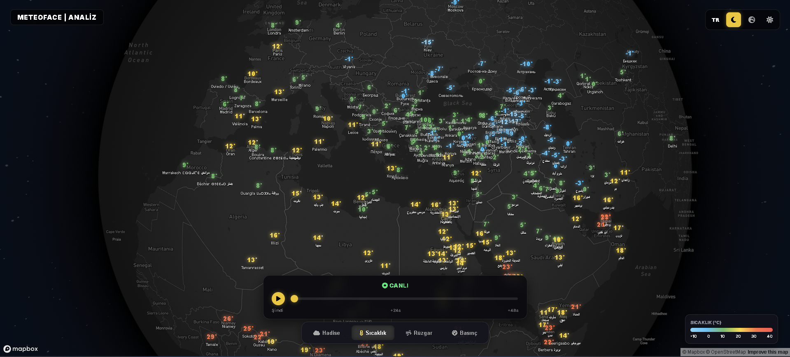

# 🌍 MeteoFace | 3D Weather Analysis Dashboard


**MeteoFace**, modern web teknolojileri kullanılarak geliştirilmiş, 3D küre üzerinde çalışan interaktif bir meteorolojik analiz panelidir. Standart hava durumu uygulamalarının aksine, **izobar (eş basınç) analizi**, **rüzgar vektörleri** ve **atmosferik tahminleri** görselleştirerek profesyonel bir deneyim sunar.

[🔴 CANLI DEMO İÇİN TIKLA](https://silvermasterpiece.github.io/MeteoFace/) 
*(Buraya kendi GitHub Pages linkini ekleyeceksin)*

---

## 📸 Ekran Görüntüleri

| Genel Görünüm (Karanlık Mod) | Basınç ve İzobar Analizi |
|:---:|:---:|
|  |  |
*(Not: Projene 'assets' klasörü açıp ekran görüntülerini oraya koyabilirsin)*

---

## ✨ Temel Özellikler

* **🌍 3D İnteraktif Küre:** Mapbox GL JS altyapısı ile tamamen döndürülebilir, yakınlaştırılabilir dünya haritası.
* **⚡ Canlı Veri Akışı:** Open-Meteo API kullanılarak çekilen anlık (Real-time) sıcaklık, rüzgar, nem ve basınç verileri.
* **〰️ Dinamik İzobar Çizimi:** `Turf.js` kullanılarak istemci tarafında (Client-side) hesaplanan, **matematiksel enterpolasyonla** çizilen yumuşak basınç eğrileri.
* **🔴 AB / 🔵 YB Analizi:** Harita üzerindeki en düşük (Alçak Basınç) ve en yüksek (Yüksek Basınç) merkezlerin otomatik tespiti ve işaretlenmesi.
* **🇹🇷 Türkiye Modu:** Tek tuşla Türkiye'ye odaklanma ve 81 ilin verisini anında analiz etme yeteneği.
* **⏳ Zaman Yolculuğu:** 48 saatlik tahmin verileri arasında gezinebilmeyi sağlayan interaktif zaman çubuğu (Time Slider).
* **🎨 Glassmorphism UI:** Modern, şeffaf ve kullanıcı dostu arayüz tasarımı.

---

## 🛠️ Kullanılan Teknolojiler

Bu proje, herhangi bir Backend (Sunucu) bağımlılığı olmadan, tamamen **Vanilla JavaScript** ile geliştirilmiştir.

* **HTML5 & CSS3:** Modern Flexbox/Grid yapısı ve CSS değişkenleri.
* **JavaScript (ES6+):** Asenkron veri çekme (Async/Await), DOM manipülasyonu.
* **Mapbox GL JS:** WebGL tabanlı harita motoru.
* **Turf.js:** Coğrafi analiz ve izobar (Isoline) hesaplamaları için matematik motoru.
* **Open-Meteo API:** Ücretsiz, açık kaynaklı meteorolojik veri sağlayıcısı.

---

## 🚀 Kurulum ve Çalıştırma

Projeyi kendi bilgisayarınızda çalıştırmak için aşağıdaki adımları izleyin:

1.  **Repoyu Klonlayın:**
    ```bash
    git clone [https://github.com/silvermasterpiece/MeteoFace.git](https://github.com/silvermasterpiece/MeteoFace.git)
    cd MeteoFace
    ```

2.  **API Anahtarı (Token) Ayarı:**
    * Bu proje [Mapbox](https://www.mapbox.com/) altyapısını kullanır.
    * `app.js` dosyasını açın.
    * `const MAPBOX_TOKEN = 'BURAYA_TOKEN_GELECEK';` satırına kendi Mapbox Public Token'ınızı yapıştırın.

3.  **Çalıştırma (Önemli!):**
    * Mapbox güvenlik politikaları gereği (CORS), proje doğrudan `index.html` dosyasına çift tıklanarak **çalışmaz.**
    * VS Code kullanıyorsanız **"Live Server"** eklentisi ile çalıştırın.
    * Veya terminalde basit bir Python sunucusu başlatın:
        ```bash
        python -m http.server 5500
        ```
    * Tarayıcıda `http://localhost:5500` adresine gidin.

---

## 🗺️ Yol Haritası (Gelecek Planları)

- [ ] **Havacılık Modu:** METAR/TAF verilerinin havalimanları üzerine işlenmesi.
- [ ] **Radar Katmanı:** Yağış bulutlarının harita üzerine hareketli (GIF) olarak eklenmesi.
- [ ] **Uyarı Sistemi:** Belirli bir eşiğin (Örn: -5°C) altındaki iller için görsel alarm.

---

## 👨‍💻 Geliştirici

**SilverMasterpiece**

* [GitHub Profilim](https://github.com/silvermasterpiece)
* [LinkedIn Profilim](https://linkedin.com/in/kullaniciadin) *(Varsa ekle)*

---

## 📄 Lisans

Bu proje MIT Lisansı ile lisanslanmıştır. Detaylar için `LICENSE` dosyasına bakabilirsiniz.
